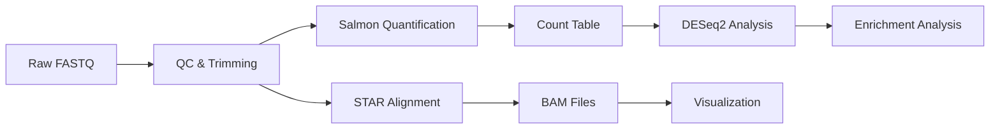
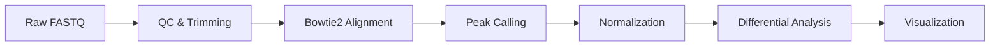

# NGS Pipeline

下一代测序（NGS）数据分析流程工具集，包含 RNA-seq、CUT&Tag 和 CRISPR 筛选分析流程。

## 📋 目录

- [功能特性](#功能特性)
- [安装](#安装)
- [快速开始](#快速开始)
- [流程说明](#流程说明)
- [文件结构](#文件结构)
- [使用示例](#使用示例)
- [依赖软件](#依赖软件)
- [常见问题](#常见问题)

---

## ✨ 功能特性

### 1. **RNA-seq 分析流程**
- ✅ Fastq 质控与修剪
- ✅ Salmon 定量（准比对）
- ✅ STAR 比对（全基因组）
- ✅ Bowtie2 比对
- ✅ 基因/转录本水平计数
- ✅ DESeq2 差异表达分析
- ✅ 功能富集分析

### 2. **CUT&Tag 分析流程**
- ✅ 质控与修剪
- ✅ 比对与峰检测
- ✅ Spike-free 标准化
- ✅ 峰定量与差异分析
- ✅ 可视化（覆盖度、热图等）

### 3. **CRISPR 筛选分析**
- ✅ MAGeCK 分析流程
- ✅ 基因校正
- ✅ 基因依赖性分析
- ✅ 结果可视化

### 4. **通用工具**
- ✅ 基因组索引构建（Salmon/STAR/Bowtie2）
- ✅ GTF 到 BED 转换
- ✅ Nextflow 流程集成
- ✅ 通用辅助函数库

---

## 🔧 安装

### 1. 克隆仓库
```bash
git clone https://github.com/soulong/ngs_pipeline.git
cd ngs_pipeline
```

### 2. 创建 Conda 环境（推荐）
```bash
conda env create -f environment.yml
conda activate ngs
```

### 3. 手动安装依赖（可选）
```bash
# 核心工具
conda install -c bioconda salmon star bowtie2 samtools bedtools

# R 包
conda install -c bioconda bioconductor-deseq2 bioconductor-edger r-qqnorm

# Python 包
pip install pandas numpy matplotlib seaborn
```

---

## 🚀 快速开始

### RNA-seq 分析

```bash
# 1. 准备数据
dataset_dir=/path/to/your/dataset
cd $dataset_dir

# 2. 复制流程脚本
cp -r /path/to/ngs_pipeline/RNAseq ./scripts

# 3. 运行流程
bash ./scripts/RNAseq/RNAseq_Step_1_Run.sh config.yml
```

### CUT&Tag 分析

```bash
# 1. 进入数据目录
cd /path/to/cuttag_dataset

# 2. 生成 samplesheet
bash /path/to/ngs_pipeline/CutTag/run_cuttag.sh config.yml

# 3. 编辑 samplesheet.csv 和 config.yml

# 4. 运行流程
bash /path/to/ngs_pipeline/CutTag/run_cuttag.sh config.yml
```

---

## 📊 流程说明

### RNA-seq 流程



**步骤：**
1. **Step 1:** 质控与定量（`RNAseq_Step_1_Run.sh`）
2. **Step 2:** 定量分析（`RNAseq_Step_2_Quantification.qmd`）
3. **Step 3:** 差异表达（`RNAseq_Step_3_DESeq2.qmd`）
4. **Step 4:** 富集分析（`RNAseq_Step_4_Enrichment.qmd`）

### CUT&Tag 流程



**关键脚本：**
- `run_cuttag.sh` - 主流程
- `spike_free_normalization.R` - Spike-free 标准化
- `coverage_diff_plot.R` - 覆盖度差异图
- `peak_counts_ratio_analysis.R` - 峰定量分析

### CRISPR 筛选流程


---

## 📁 文件结构

```
ngs_pipeline/
├── RNAseq/                     # RNA-seq 分析流程
│   ├── RNAseq_Step_1_Run.sh
│   ├── RNAseq_Step_2_Quantification.qmd
│   ├── RNAseq_Step_3_DESeq2.qmd
│   ├── RNAseq_Step_4_Enrichment.qmd
│   ├── RNAseq_helper.R
│   ├── convert_counts.R
│   ├── config.yml
│   └── README.md
│
├── CutTag/                     # CUT&Tag 分析流程
│   ├── run_cuttag.sh
│   ├── spike_free_normalization.R
│   ├── coverage_diff_plot.R
│   ├── cuttag_analysis.R
│   ├── peak_counts_ratio_analysis.R
│   ├── genome_fingerprint_cdf.R
│   ├── config.yml
│   ├── samplesheet.csv
│   └── README.md
│
├── CRISPR/                     # CRISPR 筛选分析
│   ├── MAGeCK_run.sh
│   ├── MAGeCK_analysis.qmd
│   ├── MAGeCK_mle_design.txt
│   ├── gene_symbol_correction.xlsx
│   └── Gene Dependency Profile Summary.csv
│
├── helper.sh                   # 通用辅助函数
├── make_index.sh               # 基因组索引构建
├── gtf_to_bed.R                # GTF 转 BED
├── peak_process.R              # 峰处理
└── nextflow.sh                 # Nextflow 流程
```

---

## 💻 使用示例

### 示例 1：构建基因组索引

```bash
# 编辑 make_index.sh 中的参考基因组路径
bash make_index.sh

# 输出：
# - salmon/          # Salmon 索引
# - star/            # STAR 索引
# - bowtie2/         # Bowtie2 索引
```

### 示例 2：RNA-seq 分析

```bash
# 配置文件 config.yml
samples:
  - name: control_1
    fastq1: /path/to/control_1_R1.fastq.gz
    fastq2: /path/to/control_1_R2.fastq.gz
  - name: treatment_1
    fastq1: /path/to/treatment_1_R1.fastq.gz
    fastq2: /path/to/treatment_1_R2.fastq.gz

reference:
  transcriptome: /path/to/salmon_index
  genome: /path/to/star_index
  gtf: /path/to/annotation.gtf

# 运行
bash RNAseq/RNAseq_Step_1_Run.sh config.yml
```

### 示例 3：CUT&Tag 分析

```bash
# 配置文件 config.yml
experiment:
  name: H3K27ac_cuttag
  antibody: H3K27ac
  organism: human

samples:
  - name: sample_1
    fastq: /path/to/sample_1.fastq.gz
    condition: control
  - name: sample_2
    fastq: /path/to/sample_2.fastq.gz
    condition: treatment

# 运行
bash CutTag/run_cuttag.sh config.yml
```

---

## 📦 依赖软件

### 核心工具
| 软件 | 版本 | 用途 |
|------|------|------|
| Salmon | ≥1.9 | 转录本定量 |
| STAR | ≥2.7 | 全基因组比对 |
| Bowtie2 | ≥2.5 | 快速比对 |
| SAMtools | ≥1.15 | BAM 文件处理 |
| BEDTools | ≥2.30 | 基因组区间操作 |

### R 包
| 包名 | 用途 |
|------|------|
| DESeq2 | 差异表达分析 |
| edgeR | 差异表达分析 |
| ggplot2 | 可视化 |
| pheatmap | 热图绘制 |
| ChIPseeker | 峰注释 |

### Python 包
| 包名 | 用途 |
|------|------|
| pandas | 数据处理 |
| numpy | 数值计算 |
| matplotlib | 绘图 |
| seaborn | 统计绘图 |

---

## ❓ 常见问题

### Q1: 如何添加自定义参考基因组？
编辑 `make_index.sh`，添加你的 FASTA 和 GTF 文件路径。

### Q2: 如何处理双端测序数据？
在 `samplesheet.csv` 中指定 `fastq1` 和 `fastq2` 列。

### Q3: 如何调整质控参数？
编辑对应流程的 `config.yml` 文件中的 QC 参数。

### Q4: 内存不足怎么办？
在 `make_index.sh` 中调整 `--limitGenomeGenerateRAM` 参数。

---

## 📝 注意事项

1. **数据备份：** 运行前备份原始数据
2. **磁盘空间：** 确保有足够空间（RNA-seq 约 50GB/样本）
3. **计算资源：** 建议使用多核服务器（≥16 核，≥64GB RAM）
4. **版本控制：** 记录使用的软件版本以便复现

---

## 🤝 贡献

欢迎提交 Issue 和 Pull Request！

---

## 📄 许可证

本项目采用 MIT 许可证 - 详见 [LICENSE](LICENSE) 文件

---

## 👤 作者

Original scripts by **Hao He**  
Pipeline organization by **soulong**

---

## 📄 许可证

本项目采用 MIT 许可证 - 详见 [LICENSE](LICENSE) 文件

---

**最后更新：** 2026-03-12
